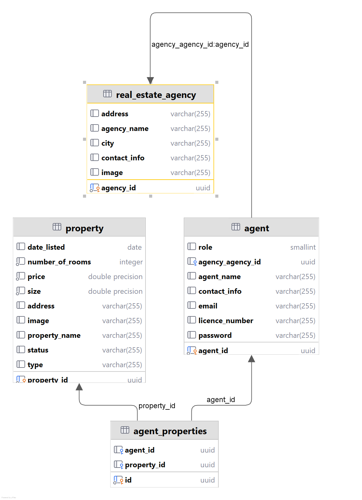
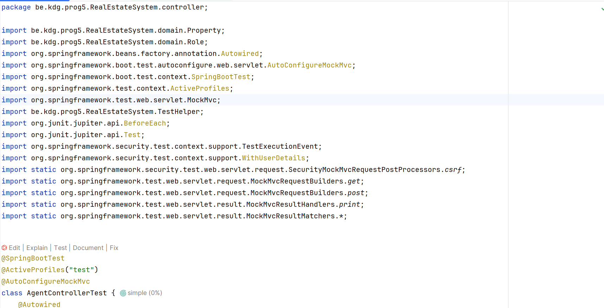
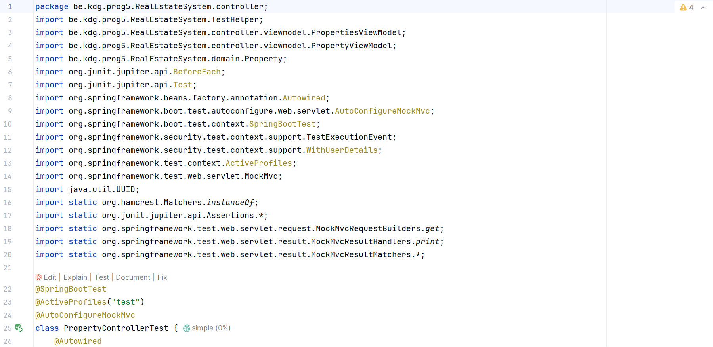
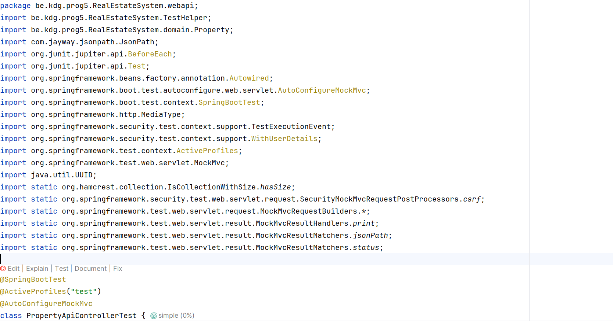
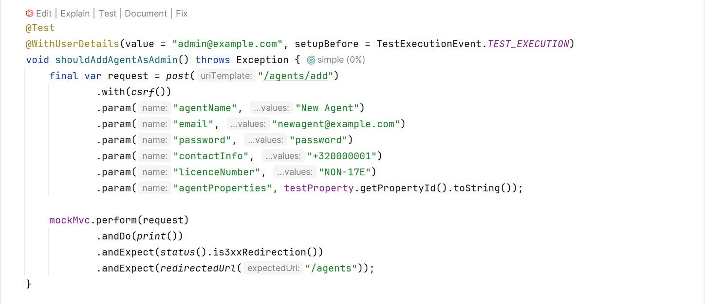
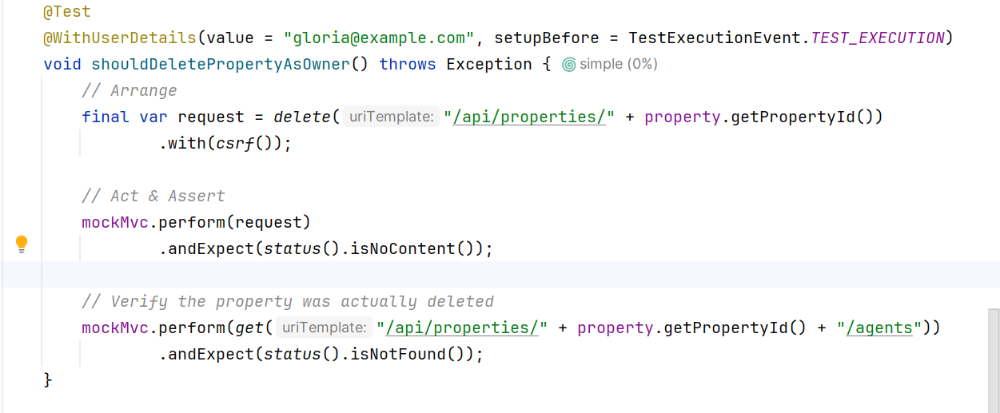

# Programming 5


# Week 1
## Real-Estate project
- Ahams Kingsley 
-  kingley.ahams@student.kdg.be, 
- ACS 201
## Domain Entities


- Build and run instructions for CLI ./gradlew build


# Week 2
## HTTP Requests and Responses


### GET /api/agents/{id}/properties - Not Found (Fetching a property for an agent)
**Request**
```bash
GET http://localhost:8080/api/agents/c6133dc3-1cc6-4beb-9c14-c8e1d435cb56/properties
Accept: application/json
````
**Reponse**
```bash
HTTP/1.1 404 

{
  "message": "Agent with ID 123e4567-e89b-12d3-a456-426614174000 was not found"
}
````

### GET /api/agents/{id}/properties - OK (Fetching a property for an agent)
### Request
```bash
GET http://localhost:8080/api/agents/d6bb59b9-c082-4282-8cda-2be47ebd17d4/properties HTTP
Accept: application/json
```

**Response**
```bash
HTTP/1.1 200 

[
  {
    "propertyId": "581a99ca-753c-422e-b3a0-780dd8a721bd",
    "propertyName": "Modern Haven",
    "address": "Nationalstraat 1 box 2",
    "price": 1400000.0,
    "type": "RESIDENTIAL",
    "size": 3000.0,
    "status": "SOLD",
    "numberOfRooms": 18,
    "dateListed": "2024-04-19",
    "image": "/images/properties/Modern Haven.jpg"
  }
]
````

### Delete /api/properties/{id} - Not found(Deleting a property that doesn't exist)
**Request**
```bash
DELETE http://localhost:8080/api/properties/581a99ca-753c-422e-b3a0-780dd8a721bd
```
**Response**
```bash
HTTP/1.1 404 
{
  "message": "Property with ID 581a99ca-753c-422e-b3a0-780dd8a721bd was not found"
}
```

### Delete /api/properties/{id} -Success(Deleting a property)
**Request**
```bash
DELETE http://localhost:8080/api/properties/07026815-3805-4ce4-bb8d-dbbc19d41a13
```
**Response**
```bash
HTTP/1.1 204 
<Response body is empty>

Response code: 204; Time: 55ms (55 ms); Content length: 0 bytes (0 B)
```


# Week 3
## HTTP Requests and Responses## HTTP Requests and Responses


### POST /api/properties - Bad request(Adding property with a wrong propertytype)
**Request**

```bash
POST http://localhost:8080/api/properties
content-type: application/json
Accept: application/json

{
  "propertyName" : "Example Property",
  "address" : "No 84 mystreet",
  "price": 120000000.0,
  "type": "HOME",
  "size" : 65000.0,
  "status": "AVAILABLE",
  "numberOfRooms": 8,
  "dateListed": "2025-02-25"
}
```
**Response**
```bash
HTTP/1.1 400 
{
  "timestamp": "2025-05-30T09:15:23.216+00:00",
  "status": 400,
  "error": "Bad Request",
  "path": "/api/properties"
}
```

### PATCH /api/properties/{id} - Forbidden(changing a property price while not being the owner or logged in as ADMIN)
**Request**
```bash
PATCH http://localhost:8080/api/properties/1dccab14-907f-47c3-9eac-7995619c9858
Content-Type: application/json
X-CSRF-TOKEN: iIZ5SI4nJvh3iTsIQzCnxUcy2Q58g6abDb3WgVjlA8feEk7euLNMfOwfE8pavAI_Jx2TpyRT9Gwf4Ze2O4WysjqAMvToJn6_
Cookie: JSESSIONID=022690404D5FE91E2510118D18CA3841

{
  "price": 350000.0
}
```
**Response**
```bash
HTTP/1.1 403 

{
  "timestamp": "2025-05-30T09:35:02.329+00:00",
  "status": 403,
  "error": "Forbidden",
  "path": "/api/properties/1dccab14-907f-47c3-9eac-7995619c9858"
}
```

### POST /api/agents/{id}/properties -Unauthorised(Trying to add a property whilst not logged in)
**Request**
```bash
POST http://localhost:8080/api/properties
content-type: application/json
Accept: application/json

{
  "propertyName" : "Example Property",
  "address" : "No 84 mystreet",
  "price": 120000000.0,
  "type": "AGRICULTURAL",
  "size" : 65000.0,
  "status": "AVAILABLE",
  "numberOfRooms": 8,
  "dateListed": "2025-02-25"
}
```

**Response**
```bash
HTTP/1.1 401 

You are not allowed beyond this point

Response code: 401; Time: 8ms (8 ms); Content length: 37 bytes (37 B)
```


# Week 4

## Spring Security Implementation

Spring Security is implemented to secure the Real Estate System application with user authentication and authorization. Below are the details of the implementation, including seeded users, access control, and page-specific behavior.

### Seeded Users
The following users are added to the database via `data.sql` during application startup. Each user is an `Agent` entity with a unique email, hashed password, and role (`ADMIN` or `USER`).

| Username    | Email                            | Password   | Role  |
|-------------|----------------------------------|------------|-------|
| Kingsley    | kingley.ahams@student.kdg.be     | kingsley   | ADMIN |
| Lesley      | Lesley.Tianga@student.kdg.be     | lesley     | USER  |
| Fortune     | Fortune@gmail.com                | fortune    | USER  |
| Aisosa      | Aisosa@gmail.com                 | aisosa     | USER  |


**Notes**:
- Passwords are hashed using `BCryptPasswordEncoder`.
- Users can also login using username or email

### Access Control
- **Public Page**: The landing page is accessible to everyone without authentication.
    - [Visit Landing Page](http://localhost:8080/)
    - [Agent page](http://localhost:8080/agents)
    - [Property page](http://localhost:8080/properties)
- **Authenticated Page**: The property creation page requires authentication.
    - [Add Property](http://localhost:8080/properties/add) (redirects to `/login` if not authenticated)
- **Differential Information**: The properties listing page (`/properties`) is public but shows additional actions (Edit/Delete buttons) for authenticated users, specific to the property dataset.
- **User Visibility**: The navigation bar displays the logged-in user’s email (e.g., `kingley.ahams@student.kdg.be`) and includes a logout link for authenticated users. Anonymous users see a login link.
- **REST API**: API endpoints like `POST /api/properties` require authentication, while `POST /api/properties/public` is public. All endpoints from previous weeks function as expected.
- **Logout**: Accessible via `/logout`, redirecting to the landing page.

### Implementation Details
- **Custom Login Page**: `/login` provides a form-based login with CSRF token.
- **User Entity**: Users are persisted in the `agent` table with attributes like `agent_name`, `email`, `password`, and `role`.
- **Hashed Passwords**: All passwords in `data.sql` are hashed using `BCryptPasswordEncoder`.
- **Authorization**: Method-level security (e.g., `@PreAuthorize("@authorizationService.isModificationAllowed(#principal, #id)")`) ensures only authorized users (property’s agent or ADMIN) can modify properties.
- **Navigation Bar**: Updated in `header.html` to show login status and user-specific links.
- **Consistency**: Creating and deleting properties via API requires authentication, ensuring a logical security model.


# Week 5

## Role-Based Security Implementation

This week, the Real Estate System implements role-based access control with two roles (`ADMIN` and `USER`), distinct from unauthenticated users. Users are persisted as `Agent` entities with associations to `Property` entities. Below are the seeded users, role permissions, hidden information, and entity associations.

### Seeded Users
The following users are added via `data.sql`. Each `Agent` has a unique email, hashed password (using `BCryptPasswordEncoder`), and role (`ADMIN` or `USER`).

| Username    | Email                            | Password  | Role  |
|-------------|----------------------------------|-----------|-------|
| Kingsley    | kingley.ahams@student.kdg.be     | kingsley  | ADMIN |
| Lesley      | Lesley.Tianga@student.kdg.be     | lesley    | USER  |
| Fortune     | Fortune@gmail.com                | fortune   | USER  |
| Aisosa      | Aisosa@gmail.com                 | aisosa    | USER  |


**Notes**:
- Passwords are hashed in the database. Dummy passwords are listed for testing.
- Users with empty passwords (Charlotte, Amara, Nathan, Emma) cannot log in until passwords are set.
- Credentials are displayed on `/login`.

### Roles and Permissions
The application defines three user categories with distinct access rights:

- **Unauthenticated Users**:
    - **Can**:
        - View the landing page, properties, agents, and agencies (`/`, `/properties`, `/agents`, `/agencies`).
        - View property and agent details (`/properties/{id}`, `/agents/{id}`).
        - Search agencies (`/api/agencies/search`) (for the seperate client project only)
        - Create agencies via a public endpoint (`POST /api/agencies/add`) (For the seperate client project only)
    - **Cannot**:
        - Create properties via `POST /api/properties` (requires authentication).
        - Update/delete properties (`PATCH/DELETE /api/properties/{id}`).
        - Add, update, or delete agents (`POST /agents/add`, `PUT/DELETE /api/agents/{id}`).
    - **Hidden Information**: Links to “Add Property” (`/properties/add`), “Edit”/”Delete” property actions, and “Add Agent” (`/agents/add`) are hidden in `header.html` and `properties.html` using `sec:authorize="isAuthenticated()"`. [View Properties](http://localhost:8080/properties)

- **USER Role**:
    - **Can**:
        - All unauthenticated actions.
        - Create properties (`POST /api/properties`), associating them with their `agentId`.
        - Update/delete properties they are associated with (`PATCH/DELETE /api/properties/{id}`).
        - View their email and logout link in the navbar (`header.html`).
        - Update their profile (`PUT /api/agents/{id}`)
    - **Cannot**:
        - Update/delete properties they don’t own.
        - Add or delete agents (`/agents/add`, `/DELETE /api/agents/{id}`).

- **ADMIN Role**:
    - **Can**:
        - All USER actions.
        - Update/delete any property (`PATCH/DELETE /api/properties/{id}`).
        - Add agents (`/agents/add`, `POST /agents/add`).
        - Update/delete any agent (`PUT/DELETE /api/agents/{id}`).
    - **Cannot**: None (full access to all actions).

### Entity Associations
- **User-Property Relationship**:
    - Users (`Agent`) are associated with `Property` entities via the `agent_properties` table (many-to-many).
    - When a USER or ADMIN creates a property (`POST /api/properties`), it’s linked to their `agentId` (via `CustomUserDetails.getAgentId()`).
    - Seeded associations (via `data.sql`):
        - Kingsley: Modern Haven
        - Lesley: Cityview Residence
        - Fortune: Business Plaza
        - Aisosa: Suburban Retreat
    - **Access Rules**:
        - Only the associated USER or an ADMIN can update/delete a property (`PATCH/DELETE /api/properties/{id}`), enforced by `@PreAuthorize("@authorizationService.isModificationAllowed(#principal, #id)")`.
        - Unauthenticated users cannot create or modify associations.
        - All users can view properties and their agents (`/properties/{id}`). [View Property Details](http://localhost:8080/properties/07026815-3805-4ce4-bb8d-dbbc19d41a13)

### Implementation Details
- **Roles**: Defined in `Role.java` as `ADMIN` and `USER`.
- **Access Control**: `SecurityConfig.java` permits public access to `/`, `/properties`, `/agents`, etc., while requiring authentication for others. Method-level security (`@PreAuthorize`) enforces role-based restrictions.
- **CSRF**: Enabled (except for `/api/agencies/**`) For client side project.
- **Hidden Actions**: `header.html`, `properties.html`, and `property-details.html` use `sec:authorize` to hide unauthorized actions (e.g., “Edit”/”Delete” for unauthenticated users).
- **API**: `POST /api/agencies/add`, `GET /api/agencies/search` are  public. All prior endpoints work as expected.
- **Consistency**: Creating properties requires authentication, and updating/deleting is restricted to associated users or ADMINs, ensuring a logical security model.
- **Backend Verification**: `AuthorizationService` checks user permissions for property and agent modifications.


# Week 6
## Testing

### Spring Profiles
The application uses the following Spring profiles:
- `test`: Used for running tests with a separate database configuration

### Running Tests
To run the tests from the command line:

```bash
# Run all tests
./gradlew test

# Run tests with the test profile
./gradlew test -Dspring.profiles.active=test

# Run a specific test class
./gradlew test --tests AgentServiceTest

# Run Specific Test Method
./gradlew test --tests AgentRepositoryTest.deletingAgentShouldRemoveAssosiatedProperies
```


# Week 8

```bash

# to build and run the project
./gradlew bootRun

./gradlew clean test --tests "*.RealEstateSystem.*" -Dspring.profiles.active=test
```

## MVC integration tests

### AgentControllerTest


### PropertyControllerTest



## API integration tests

### PropertyApiControllerTest


## ROLE verification tests

### Add Agent endpoint in AgentControllerTest


### Should delete Property as Owner in PropertyApiControllerTest



# Week 10
## Unit Testing and Continuous Integration

### Unit Testing
- **Mocking Tests**:
    - `AgentAPiControllerUnitTest.java`: Tests `PUT /api/agents/{id}` with mocked `AgentService`, `AgentMapper`, and `AuthorizationService`.
    - `AgentServiceUnitTest.java`: Tests `findAgentById`, `remove`, and `updateAgent` with mocked `AgentRepository`, `AgentPropertyRepository`, and `BCryptPasswordEncoder`.
- **Verify Tests**:
    - `AgentAPiControllerUnitTest.java`: `shouldUpdateAgentSuccessfully` verifies `agentService.updateAgent(...)` call.
    - `AgentServiceUnitTest.java`: `shouldRemoveAgentAndItsProperties` verifies `agentPropertyRepository.deleteAll()` and `agentRepository.deleteById()` calls.

### Continuous Integration
- **Pipeline**: Defined in `.gitlab-ci.yml` with build and test stages, using a PostgreSQL 17.2 service and caching build artifacts.
- **Test Report**: [View Test Report](https://kdg-ti.gitlab.io/-/programming-5/projects-24-25/acs201/kingley.ahams/spring-backend/-/jobs/10203615131/artifacts/build/reports/tests/test/index.html) 


# Week 12

## Build Instruction

```bash

# To Install dependencies
npm install

# To build the project(webpack) 
npm run build

# To build and run the project
./gradlew bootRun
```
## Added features

### Bootstrap Icon
- Added home Icon (bi bi-house) for navbar
- URL(Any page that has the navbar but the index page)
- Source file(resources/templates/fragments/header.html)

### Form Validation
- Form validated: add property form
- URL(http://localhost:8080/properties/add)
- Source file(src/main/js/AddProperty.js), (resources/templates/fragments/addproperty.html)

### Javascript Dependencies
- tsparticles
- Source file(/package.json)

- animeJs
- Source file(/package.json)